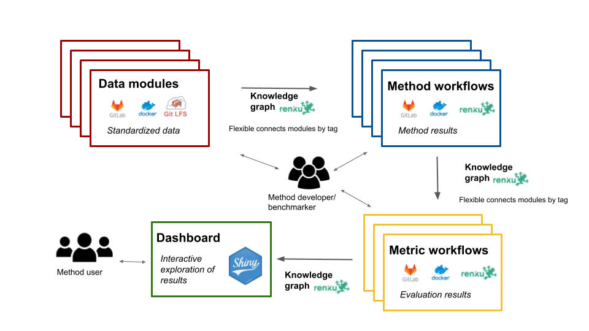
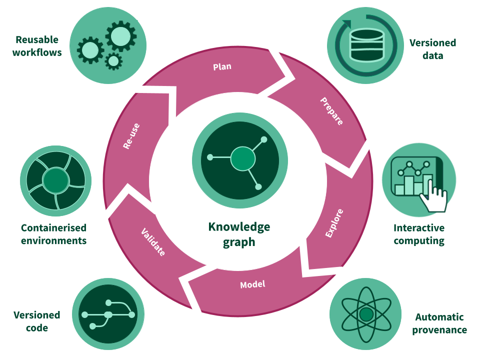

<style>
#main-img-left {
 width: 6%;
}
#main-img-center {
 width: 10%;
}
#main-img-right {
 width: 8%;
}
</style>


```{r, include=FALSE}
knitr::opts_chunk$set(echo = FALSE,
                      warning = FALSE,
                      tidy = FALSE,
                      message = FALSE,
                      fig.align = 'center',
                      out.width = "100%")
options(knitr.table.format = "html") 
```
  
#
#

# BACKGROUND

**Benchmarking** is a critical step for the development of bioinformatic methods and provides important insights for their application.  
The current benchmarking scheme has many **limitations**:

+ it is a `snapshot` of the available methods at a certain time point
+ it can be `outdated`, already at the time of a publication
+ `comparison of benchmarks is challenging`: different procedures, different datasets, different evaluation criteria, etc.
+ all of the above can lead to `different conclusions` among benchmarks made at different time points or at different groups.

#
#  
  
# CONCEPT: 

→ Here we propose a new **modular** and **extensible** framework based on a free open-source analytic platform, **`RENKU`**, to offer a continuous and open `community benchmarking system`.

→ The framework consists of `data`, `method` and `metric` repositories (or “modules”) that are connected via a **`knowledge graph`** from the **`RENKU system`**. 

→ The results could then be displayed in an **interactive dashboard** to be openly explored by any analyst looking for recommendations of tools

→ Any new data, method or metric can be added by the **community** to extend the benchmark


### Key features of the developed benchmarking framework: 

+ Update the results of the benchmark periodically to provide the analysts with the latest recommendations
+ Be easily extended thanks to templates for data, methods or metrics
+ Fully follow the **`FAIR principles`** thanks to a Docker image system, an integration with Gitlab and the full **`provenance`** (tracking of inputs, commands and generated files)
+ Use a **variety of programming languages** commonly used in bioinformatics: R, Python, Bash, Julia,...

```{r omni, echo=FALSE, out.width="100%"}

``` 

#
#

# PROTOTYPE 

Based on the above concept, we are currently building a prototype for community-based benchmarking of single cell batch correction methods. 
The research in **`single-cell`** is a perfect use-case, where 900 tools have been developed in only a few years *[https://www.scrna-tools.org/]* and where the benchmarking efforts are often **not** `coordinated`, **not** `extendable` and **not** `reproducible`.

**_Our prototype consists of_**:

+ Two datasets of 2370 genes x 3613 cells separated in 2 batches  and 1401 genes x 13575 cells separated in 3 batches [@su_cellbench_2020; @lutge_cellmixs_2021]
+ Common preprocessing consisting of normalization, highly-variable genes selection, dimensionality reduction. 
+ An integration using the MNN method [@haghverdi_batch_2018]
+ Evaluating batch-effect using the LISI metric [@korsunsky_fast_2019] and cms score [@lutge_cellmixs_2021]
+ Exploring the results using the bettr [@R-bettr]

#
#

```{r renku logo, echo=FALSE, out.width="20%"}

``` 

**RENKU** is an open-source collaborative platform that provides the following features:

+ `knowledge infrastructure` that seamlessly integrates interactive sessions
+ automatic provenance tracking
+ GitLab CI/CD
+ version control systems for code, data and containerized environments
+ coupling of CI/CD components with the knowledge graph

```{r renku, echo=FALSE, out.width="100%"}

``` 

# References
