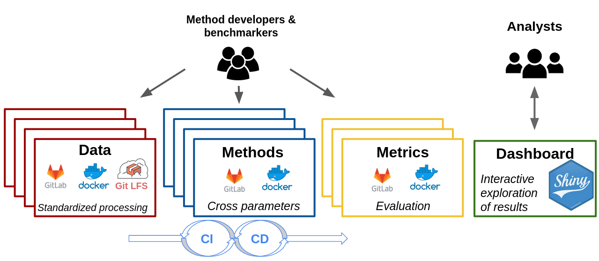
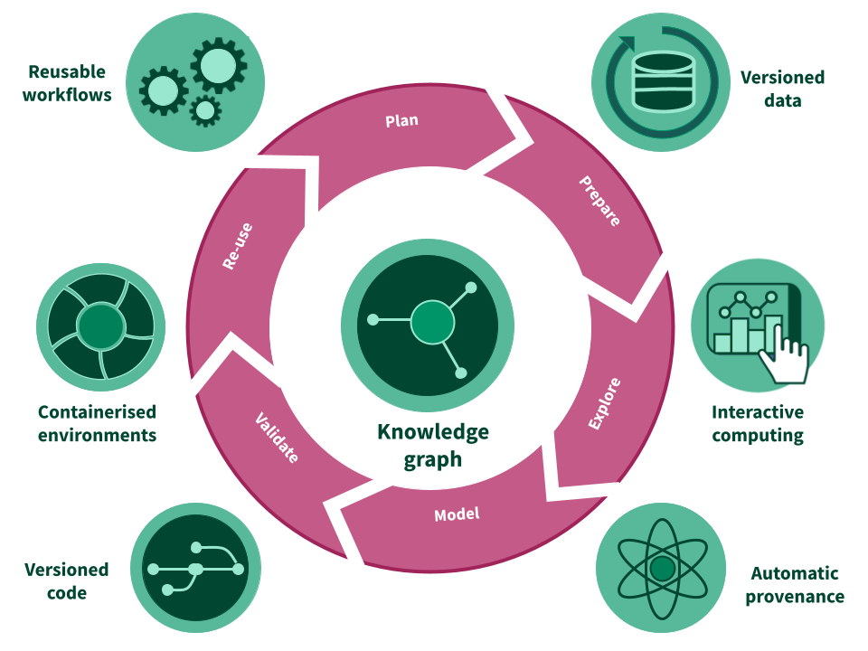

<style>
#main-img-left {
 width: 6%;
}
#main-img-center {
 width: 10%;
}
#main-img-right {
 width: 8%;
}
</style>


```{r, include=FALSE}
knitr::opts_chunk$set(echo = FALSE,
                      warning = FALSE,
                      tidy = FALSE,
                      message = FALSE,
                      fig.align = 'center',
                      out.width = "100%")
options(knitr.table.format = "html") 
```
  
#

# BACKGROUND


**Benchmarking** is critical for the development of performant computational methods and provides important insights for their application. In particular, methods research in **single-cell RNA-seq (scRNA-seq)** provides a perfect use case, where more than 900 tools have been developed in only a few years [@zappia_exploring_2018]. Benchmarking efforts are often **not** **`coordinated`**, **not** **`extensible`** and **not** **`reproducible`**.


Current benchmarking approaches have many **limitations**:

-- they represent only a **`snapshot`** of the available methods at a certain time point.   
-- they become quickly **`outdated`**, even at the time of a publication.  
-- they suffer **`low comparability`**: different procedures, different datasets, different evaluation criteria.  
-- they lack **`standardization`**; each benchmarker decides the importance of performance criteria
-- all of the above can lead to **`different conclusions`** among benchmarks made at different time points or at different groups.   

#  
  
# CONCEPT 

$\checkmark$ We propose a new **`modular`** and **`extensible`** framework based on a free open-source analytic platform, **`RENKU`**, to offer a continuous and open **`community benchmarking system`**.

$\checkmark$ The framework consists of **`data`**, **`method`** and **`metric`** repositories (or “modules”) that are connected via a **`knowledge graph`**. 

$\checkmark$ Performance results can be coupled with an **`interactive dashboard`** to be explored flexibly by any analyst looking for tool recommendations.

$\checkmark$ New datasets, methods or metrics can be added by the **`community`**.


<br/>

**_Key features of the developed benchmarking framework:_**

+ Periodic updates to provide the community with the latest recommendations
+ Easily extensible with templates for data, methods or metrics
+ Follows the **`FAIR`** principles via Docker images, integration with Gitlab and full **`provenance`** (tracking of inputs, commands and generated files)
+ Uses **`independent (docker) environments`** and flexibly connects and shares modules within and between benchmarks.
+ Flexibility to accommodate **`various programming languages`** used in bioinformatics: R, Python, Bash, Julia, etc.

```{r omni, echo=FALSE, out.width="90%", fig.cap="Overview of the proposed benchmarking framework on the RENKU platform. Each step of the benchmark consists of a set of repositories (a.k.a “modules”) that perform a coordinated task (e.g. standardized data processing). New datasets, methods or metrics can be easily integrated into the framework to trigger a continuous delivery to the analysts with up-to-date recommendations. Each component of the framework is automatically tracked by the knowledge graph of RENKU, utilizing Docker images to provide fully reproducible results."}



``` 

<br/>

#

# PROTOTYPE 

We are currently building a prototype (Figure 1) for community-based benchmarking of single-cell batch correction methods. 

**_Our prototype consists of_**:

+ Two datasets: i) one with 2370 genes x 3613 cells separated in 2 batches; and, ii) one with 1401 genes x 13575 cells separated in 3 batches [@su_cellbench_2020; @lutge_cellmixs_2021].
+ Standardized preprocessing consisting of normalization, highly-variable genes selection, dimensionality reduction. 
+ An integration using the MNN method [@haghverdi_batch_2018] (Figure 2).
+ Evaluation of batch-effect correction using the LISI metric [@korsunsky_fast_2019] and cms score [@lutge_cellmixs_2021].
+ Exploring the results using the interactive browser bettR [@R-bettr] (Figure 2).

```{r proto1, echo=FALSE, out.width="95%", fig.cap="Example of the proposed framework applied to benchmark single cell RNA-seq batch correction methods. Datasets are uniformly processed and passed to a batch-correction method within a separate module. Results are displayed in a shiny app for an interactive exploration of the results. All modules are connected through the RENKU knowledge graph, which allows workflows to be tracked from a set of repositories using different environments and programming languages." }

knitr::include_graphics("figures/proto_small.png")
``` 


#

```{r renku logo, echo=FALSE, out.width="20%"}
knitr::include_graphics("figures/logo_renku.svg")
``` 

#

**RENKU** is an open and collaborative platform that provides a knowledge infrastructure for the entire research life cycle. The platform and its tools are built on top of a stack of open-source components and aims to make data science reproducible. 

On **RENKU**:

+ Since RENKU is based on cloud computing, fully interactive sessions can be accessed via a the browser, with no local installation needed.

+ Versioning and containers ensure precise and reproducible computational environments.

+ Datasets and workflows are automatically tracked in a **`knowledge graph`**, which can be queried from within a project, a group of projects or even across deployments.

+ Workflows can be re-run or updated automatically when inputs such as datasets or scripts change. 

+ CI/CD can be leveraged to automate cumbersome tasks, such as fetching results of a piece of analysis to integrate into a dashboard.


```{r renku, echo=FALSE, out.height="70%", out.width="70%"}

``` 

# References
