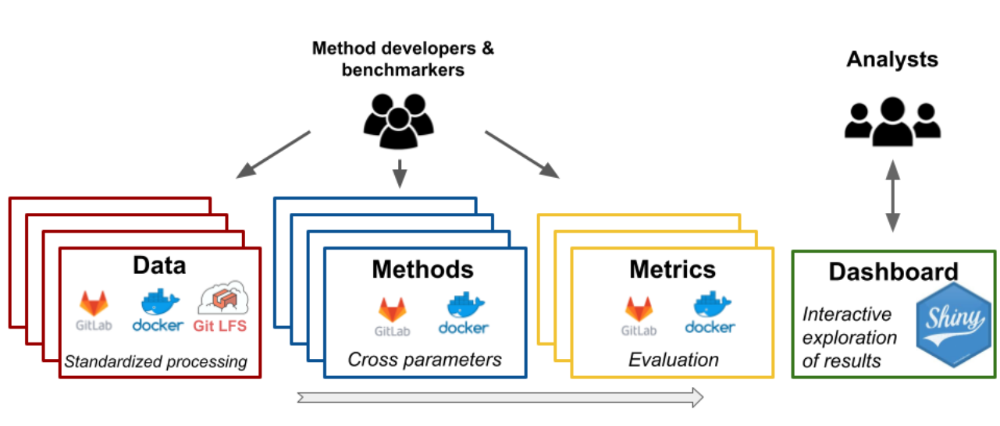
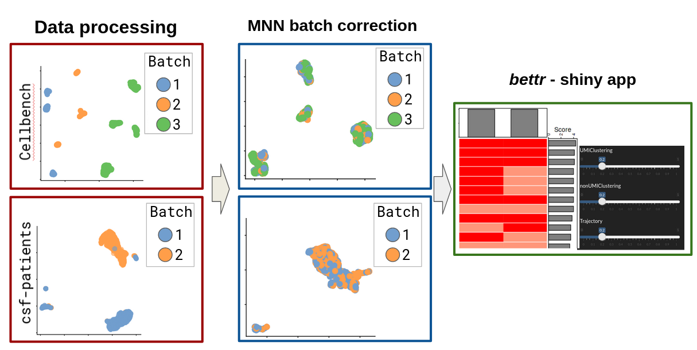

<style>
#main-img-left {
 width: 6%;
}
#main-img-center {
 width: 10%;
}
#main-img-right {
 width: 8%;
}
</style>


```{r, include=FALSE}
knitr::opts_chunk$set(echo = FALSE,
                      warning = FALSE,
                      tidy = FALSE,
                      message = FALSE,
                      fig.align = 'center',
                      out.width = "100%")
options(knitr.table.format = "html") 
```
  
#

# BACKGROUND


**Benchmarking** is a critical step for the development of bioinformatic methods and provides important insights for their application.  
The current benchmarking scheme has many **limitations**:

-- it is a **`snapshot`** of the available methods at a certain time point  
-- it can be **`outdated`**, already at the time of a publication  
-- **`low comparability`**: different procedures, different datasets, different evaluation criteria  
-- all of the above can lead to **`different conclusions`** among benchmarks made at different time points or at different groups.  

<br/>

#  
  
# CONCEPT: 

$\checkmark$ Here we propose a new **modular** and **extensible** framework based on a free open-source analytic platform, **`RENKU`**, to offer a continuous and open **`community benchmarking system`**.

$\checkmark$ The framework consists of **`data`**, **`method`** and **`metric`** repositories (or “modules”) that are connected via a **`knowledge graph`** from the **`RENKU system`**. 

$\checkmark$ The results could then be displayed in an **interactive dashboard** to be openly explored by any analyst looking for recommendations of tools

$\checkmark$ Any new data, method or metric can be added by the **community** to extend the benchmark


### Key features of the developed benchmarking framework: 

+ Update the results of the benchmark periodically to provide the analysts with the latest recommendations
+ Be easily extended thanks to templates for data, methods or metrics
+ Fully follow the **`FAIR principles`** thanks to a Docker image system, an integration with Gitlab and the full **`provenance`** (tracking of inputs, commands and generated files)
+ Use a **variety of programming languages** commonly used in bioinformatics: R, Python, Bash, Julia,...

```{r omni, echo=FALSE, out.width="90%", fig.cap="Overview of the proposed benchmarking framework on the Renku platform. Each step of the benchmark consists of a set of repositories (a.k.a “modules”) that perform a coordinated task (e.g. standardized data processing). Any new data, method or metric can be easily integrated in the framework by the scientific community and trigger a continuous delivery to the analysts with up-to-date recommendations. Each component of the framework is automatically tracked by the knowledge graph of Renku and contain Docker images to provide fully reproducible results."}



``` 

<br/>

#

# PROTOTYPE 

Based on the above concept, we are currently building a prototype for community-based benchmarking of single cell batch correction methods. 
The research in **`single-cell`** is a perfect use-case, where 900 tools have been developed in only a few years [@zappia_exploring_2018] and where the benchmarking efforts are often **not** **`coordinated`**, **not** **`extendable`** and **not** **`reproducible`**.

**_Our prototype consists of_**:

+ Two datasets of 2370 genes x 3613 cells separated in 2 batches  and 1401 genes x 13575 cells separated in 3 batches [@su_cellbench_2020; @lutge_cellmixs_2021]
+ Common preprocessing consisting of normalization, highly-variable genes selection, dimensionality reduction. 
+ An integration using the MNN method [@haghverdi_batch_2018]
+ Evaluating batch-effect using the LISI metric [@korsunsky_fast_2019] and cms score [@lutge_cellmixs_2021]
+ Exploring the results using the bettr [@R-bettr]

```{r proto1, echo=FALSE, out.width="95%", fig.cap="Example of the proposed framework applied to benchmark batch correction methods of scRNA-seq data. Datasets are uniformly processed and passed to a batch-correction method of a separated module. Results are displayed in a shiny app for an interactive exploration of the results. All modules are connected through the Renku knowledge graph, which allows to track workflows from a set of repositories using different environments and programming languages." }


``` 

<br/>

#

```{r renku logo, echo=FALSE, out.width="20%"}
knitr::include_graphics("figures/logo_renku.svg")
``` 

#

**RENKU** is an open and collaborative platform which provides a knowledge infrastructure for the entire research life cycle. The platform and its tools are built on top of a stack of open-source components and aims to make data science reproducible. 

On **RENKU**:

+ Fully interactive sessions can be accessed through the browser, with no local installation needed

+ Versioning and containers ensure precise and reproducible computational environments

+ Datasets and workflows are automatically tracked in a **`knowledge graph`**, which can be queried from within a project, a group of projects or even across deployments

+ Workflows can be re-run or updated automatically when inputs such as datasets or scripts change 

+ CI/CD can be leveraged to automate repetitive and predictable tasks, such as fetching results of a piece of analysis to integrate into a dashboard


```{r renku, echo=FALSE, out.height="70%", out.width="70%"}
knitr::include_graphics("figures/renku.png")
``` 

# References
